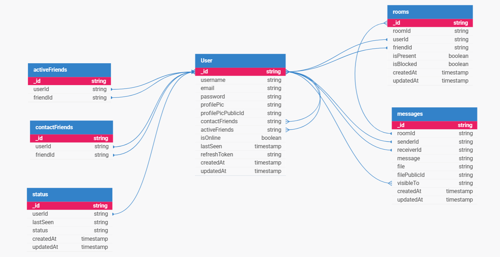

# 🧠 Chat App Backend

A modular, real-time backend built for reliability, clarity, and emotional connection.  
Handles authentication, message delivery, presence tracking, and cross-device consistency with precision.

---

## 🧬 Backend Schema

Here’s a visual representation of the database schema:

---

## ⚙ Tech Stack

- *Node.js + Express* — Core server logic and routing
- *MongoDB* — Message store, user profiles, and session persistence
- *Redis* — Pub/Sub for real-time presence and delivery
- *JWT* — Secure authentication across devices
- *Crypto* — Message encryption for privacy and integrity
- *WebSockets (Socket.IO)* — Real-time communication layer

---

## 📦 Features

- *Authentication*: Login, signup, and token refresh with payload validation
- *Message Delivery*: Reliable, ordered delivery with retry logic
- *Encrypted Messaging*: Messages are encrypted using Node's `crypto` module before storage
- *Presence Tracking*: Heartbeat-based online status with Redis expiry
- *Cross-Device Sync*: Universal reliability across browsers and devices
- *Error Boundaries*: Graceful handling of edge cases and serialization quirks

🧭 Final Notes

This backend isn’t just a system—it’s a foundation for connection.  
Every encrypted message, every heartbeat ping, every media upload is part of a larger rhythm:  
clarity in architecture, emotion in experience, and trust in delivery.

— Krish Vardhan Pal
